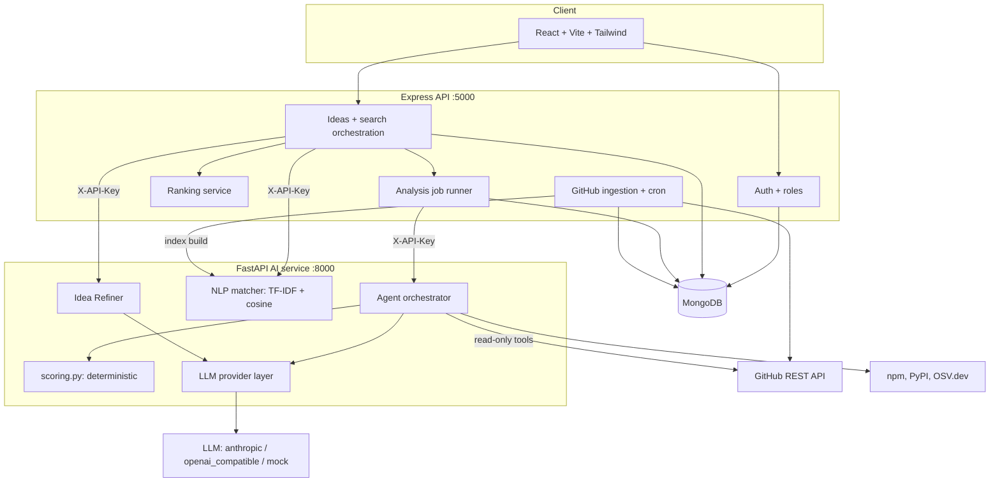
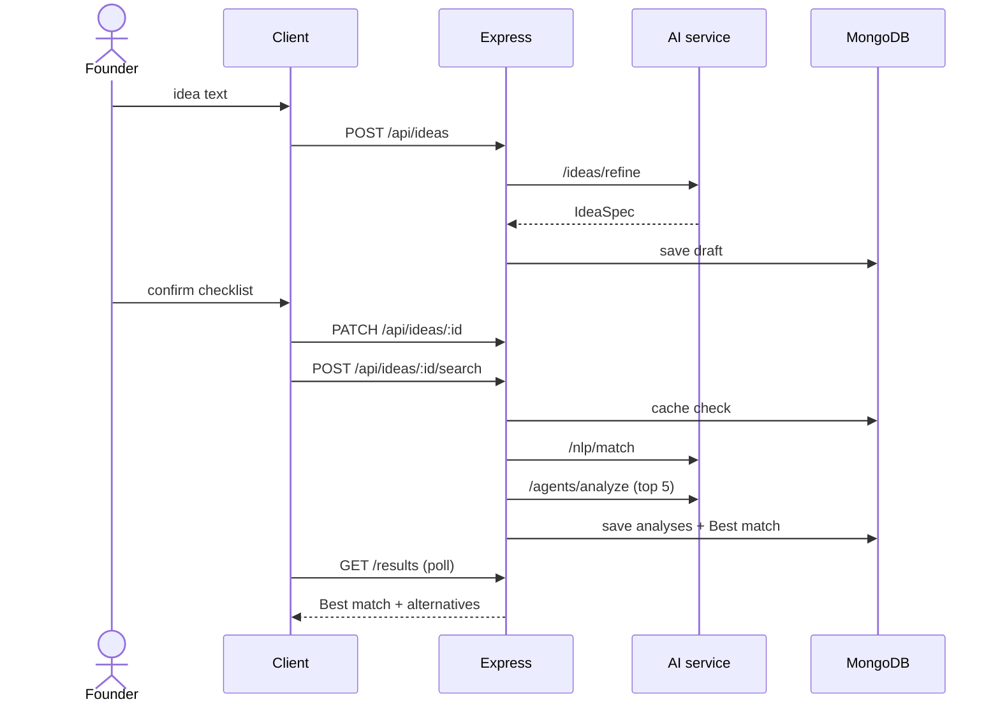
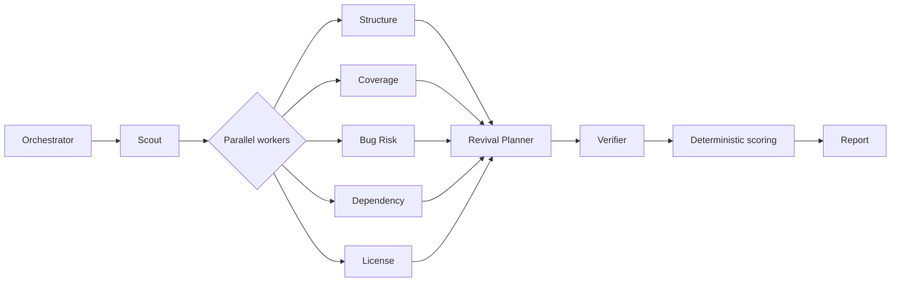
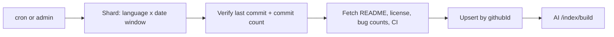

# Architecture

Source of truth with `CLAUDE.md`, `docs/AGENT_DESIGN.md`, `docs/API_SPEC.md` and `docs/DATA_MODEL.md`. If code and docs disagree, stop and ask.

## 1. Components

- React client: idea wizard, checklist editor, results, report, Founder Brief, admin.
- Express API: auth, ideas, search orchestration, cache, job runner, GitHub ingestion, all DB writes.
- FastAPI AI service (internal, `X-API-Key`): `/ideas/refine`, `/nlp/match`, `/index/build`, `/agents/analyze`.
- MongoDB: users, ideas, repositories, queries, analyses, ingestion_jobs.
- External: GitHub REST API, LLM provider, npm registry, PyPI, OSV.dev.

## 2. Architecture diagram



## 3. Tech stack

| Layer | Tech |
| --- | --- |
| client/ | React 18, Vite, Tailwind, React Router, Axios |
| server/ | Node 20, Express, Mongoose, Zod, JWT, Pino, helmet, cors, express-rate-limit, node-cron |
| ai-service/ | Python 3.11, FastAPI, Pydantic v2, scikit-learn, NLTK, httpx, joblib, tenacity, ruff |
| LLM layer | Provider interface: `anthropic`, `openai_compatible` (Gemini, Groq, Ollama), `mock` |
| Database | MongoDB 7 (Atlas in production) |
| Infra | Docker Compose locally; Render (server, ai-service) and Vercel (client) |
| Tests | Vitest + Supertest + mongodb-memory-server (server); pytest + respx (ai-service); Vitest + React Testing Library (client) |

## 4. Folder layout

```
reporevive/
├── client/        pages/, components/, hooks/, api/, context/, utils/
├── server/        src/{config,routes,controllers,services,models,middleware,utils,jobs}, tests/
├── ai-service/    app/{api,core,nlp,ideas,agents,tools,llm,schemas}, tests/
├── scripts/       seed, ingest, label, benchmark
├── data/          samples.json (20 ideas + 20 stale repo links)
└── docs/          source of truth for features, API and scoring
```

## 5. Flow A – Idea to Best match

1. `POST /api/ideas {text}` -> AI `/ideas/refine` -> checklist saved (status `draft`).
2. Founder edits and confirms -> `PATCH /api/ideas/:id` (status `confirmed`).
3. `POST /api/ideas/:id/search` -> cache check (checklist hash) -> AI `/nlp/match` with the expanded query -> top 20 by relevance saved.
4. Server queues analyses for the top `AUTO_ANALYZE_TOP_K` (reuses an analysis < 7 days old for the same checklist) -> AI `/agents/analyze {repo, features}`.
5. Server computes final scores, picks the Best match (no blocking flag), stores results.
6. Client polls `GET /api/ideas/:id/results`; partial results appear as each analysis lands.



## 6. Flow B – One analysis

Orchestrator -> Scout -> Structure, Coverage, Bug Risk, Dependency, License (in parallel) -> Revival Planner -> Verifier -> deterministic scoring -> report.



## 7. Flow C – Ingestion (cron + admin)

Shard GitHub search by language x pushed-date windows -> verify last commit date and commit count -> fetch README, license, bug-label counts, last CI result -> upsert -> AI `/index/build`.



## 8. Agent roles (summary; full detail in docs/AGENT_DESIGN.md)

Pattern: orchestrator-workers with tool use plus a Verifier, on a custom loop over a provider interface. No heavy framework (ADR-003).

| Agent | Role | Read-only tools |
| --- | --- | --- |
| Idea Refiner | Idea to summary, users, must/nice features with keywords | none |
| Orchestrator | Plans workers, enforces budgets, handles failures | none |
| Scout | Repo facts and file tree | github_repo, github_tree, github_commits |
| Structure Analyst | Entry points, frameworks, module map, stub density | github_file |
| Coverage Checker | Each feature present / partial / missing with file evidence | github_tree, github_file, search_in_tree |
| Bug Risk Analyst | Bug-label issues, last CI run, lint errors (our configs), TODO density | github_issue_counts, github_ci_status, github_file, static_lint |
| Dependency Auditor | Outdated, deprecated, vulnerable packages | github_file, registry_lookup, osv_query |
| License Checker | SPDX license, copyleft duties, missing license | github_license |
| Revival Planner | Gap list, steps, effort range, risks, Founder Brief | none (reads findings) |
| Verifier | Checks every claim against tool outputs; drops unsupported ones | none |

Scores are **not** produced by an LLM: `scoring.py` implements `docs/SCORING_RUBRIC.md`.

Guardrails: step cap (`AGENT_MAX_STEPS`), token cap (`AGENT_MAX_TOKENS_PER_RUN`), per-tool timeout, tool allow-list per agent, max file 200 KB, max 40 files per run, untrusted-content delimiters, egress only to GitHub, npm, PyPI, OSV and the LLM. Failure: a failed worker gets sub-score `unknown`, is excluded and the total is re-normalised; status `partial`.

## 9. Cross-cutting concerns

| Concern | Approach |
| --- | --- |
| Security | helmet, CORS allow-list, rate limits, Zod/Pydantic validation, secrets via env, `X-API-Key` between server and AI service |
| Safety | Static, read-only analysis; our fixed lint configs; repo content is untrusted |
| Reliability | Retry with backoff; partial results; graceful degradation when AI service or GitHub fails |
| Observability | Request ids, Pino logs, stored agent trace per analysis, `/health` on every service |
| Caching | Search cache by checklist hash (TTL); analysis reuse < 7 days; GitHub ETags |
| Testability | Mock LLM provider; all tests pass with `LLM_PROVIDER=mock`; mocked HTTP for GitHub |

## 10. Ports and runtime

| Service | Port | Health |
| --- | --- | --- |
| client | 5173 | n/a |
| server | 5000 | `GET /api/health` (also pings AI service) |
| ai-service | 8000 | `GET /health` |
| mongo | 27017 | container up |

Start everything with `docker compose up --build`.

## 11. Key decisions

See `docs/DECISIONS.md`: ADR-001 static read-only analysis, ADR-002 deterministic scoring, ADR-003 custom orchestrator, ADR-004 TF-IDF baseline, ADR-005 MongoDB, ADR-006 server owns DB writes, ADR-007 founder confirms checklist, ADR-008 "fewest bugs" definition, ADR-009 top-5 auto-analysis with daily cap, ADR-010 polling, ADR-011 repo content is untrusted.
