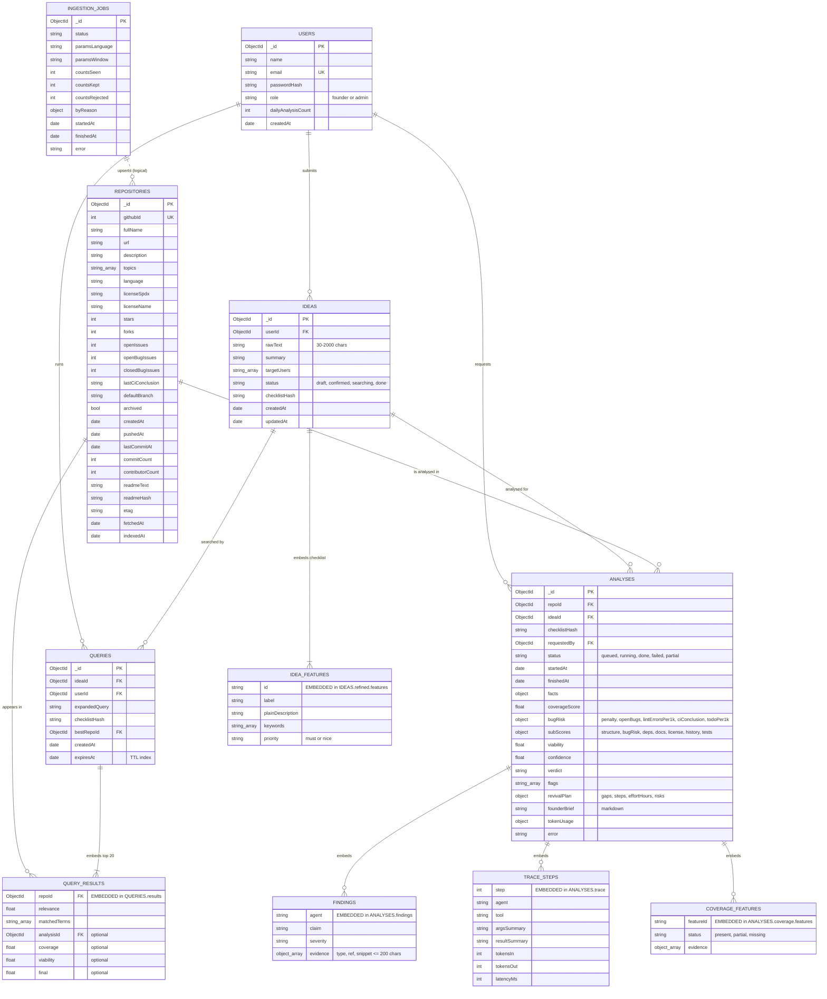

# RepoRevive – ER Diagram

Source of truth: `docs/DATA_MODEL.md`. If this file and DATA_MODEL.md disagree, fix the docs first and ask before changing code.

Database: MongoDB 7 (Atlas in production). Six collections. Some entities below are **embedded sub-documents** (marked EMBEDDED), not separate collections.

## 1. Collection-level ER diagram

## 2. Relationships (plain words)

| From | To | Cardinality | Link field |
| --- | --- | --- | --- |
| users | ideas | 1 : many | `ideas.userId` |
| users | queries | 1 : many | `queries.userId` |
| users | analyses | 1 : many | `analyses.requestedBy` |
| ideas | queries | 1 : many | `queries.ideaId` |
| ideas | analyses | 1 : many | `analyses.ideaId` |
| repositories | analyses | 1 : many | `analyses.repoId` |
| queries | repositories | many : many (via embedded `results[]`) | `queries.results[].repoId` |
| ingestion_jobs | repositories | logical only (job upserts repos) | no stored foreign key |

## 3. Indexes

| Collection | Index |
| --- | --- |
| users | `email` (unique) |
| repositories | `githubId` (unique), `fullName`, `language`, `lastCommitAt` |
| queries | `expiresAt` (TTL), `ideaId`, `checklistHash` |
| analyses | `repoId + ideaId + checklistHash` (reuse analyses < 7 days old) |

## 4. Design notes (for the viva)

- Embedded vs referenced: checklist features, query results, findings and trace steps live inside their parent because they are always read together and never queried alone (ADR-005).
- The server owns all DB writes; the AI service is stateless except its TF-IDF index file (ADR-006).
- `checklistHash` is the cache key: same confirmed checklist means the cached search and any analysis younger than 7 days are reused.
- Scores stored in `analyses` come from deterministic code only (ADR-002); the LLM never writes a number.
