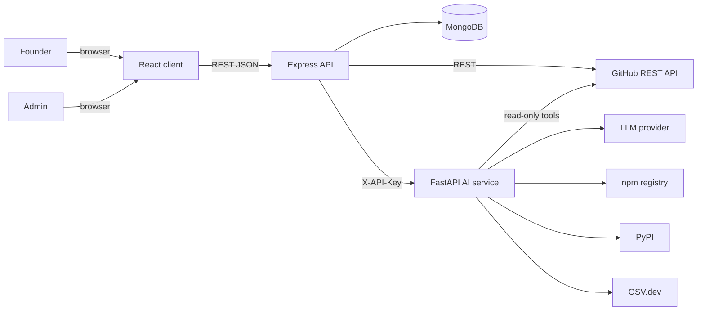
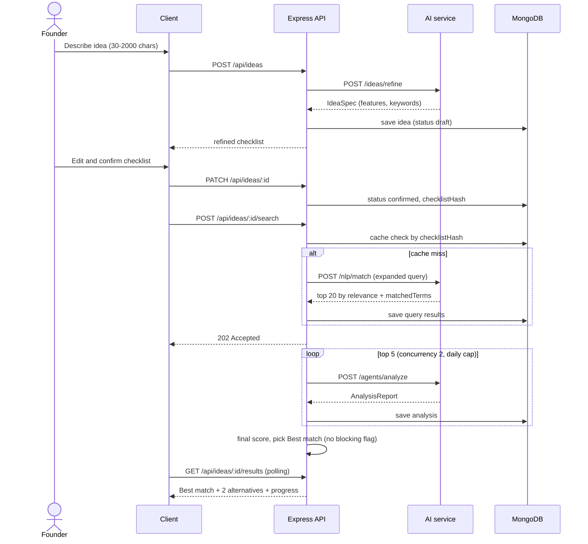
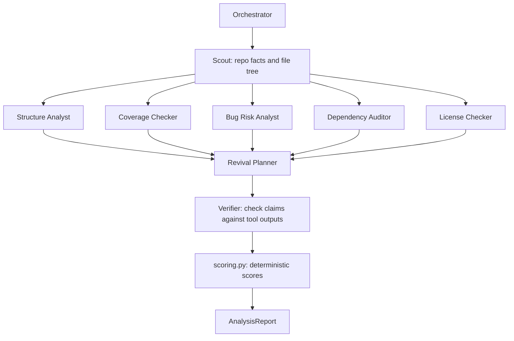
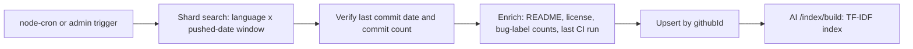
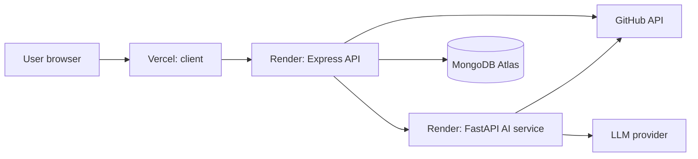

# RepoRevive – System Design

Source of truth for behaviour: `CLAUDE.md`, `docs/REQUIREMENTS.md`, `docs/SCORING_RUBRIC.md`. If this file and those disagree, stop and ask.

## 1. Purpose

A non-technical founder types an idea in plain words. RepoRevive returns the abandoned public GitHub repository that already builds most of it, with the fewest verifiable bug signals and a reusable license. It also lists what is missing and what it would take to finish.

## 2. Design goals

| Goal | How the design meets it |
| --- | --- |
| Founder-first | AI-refined feature checklist that the founder confirms; plain-language UI with tooltips |
| Evidence-backed | Every agent finding carries a file path, API field or URL; the Verifier drops unsupported claims |
| Reproducible | All scores come from deterministic code (`scoring.py`); LLMs only plan, extract and explain |
| Safe | Strictly static and read-only; no third-party code is ever executed, built, installed or imported |
| Cost-bounded | Top 5 analysed automatically, daily cap per user, step and token caps per agent run |
| Explainable in a viva | Custom orchestrator (no CrewAI/LangChain), TF-IDF baseline, small number of moving parts |

## 3. High-level system context

## 4. Components

| Component | Tech | Responsibility |
| --- | --- | --- |
| Client | React 18, Vite, Tailwind, React Router, Axios | Idea wizard, checklist editor, results, repo report, Founder Brief, history, admin |
| API server | Node 20, Express, Mongoose, Zod, JWT, Pino | Auth, ideas, search orchestration, cache, job runner, GitHub ingestion, ranking, **all DB writes** |
| AI service | Python 3.11, FastAPI, Pydantic v2, scikit-learn, NLTK, httpx | Idea Refiner, NLP matcher, agent orchestrator, scoring, provider layer |
| Database | MongoDB 7 (Atlas in production) | users, ideas, repositories, queries, analyses, ingestion_jobs |
| Infra | Docker Compose locally; Render (server, ai-service); Vercel (client) | Run and deploy |

AI service endpoints (internal, `X-API-Key`): `/ideas/refine`, `/index/build`, `/nlp/match`, `/nlp/preprocess`, `/agents/analyze`, `/health`.

## 5. Core flows

### 5.1 Idea to Best match (Flow A)

### 5.2 One repository analysis (Flow B)

Workers run in parallel where safe. A failed worker gets sub-score `unknown`, is excluded, the total is re-normalised, and the status becomes `partial`.

### 5.3 Ingestion (Flow C)

Keep a repo only if `lastCommitAt` is older than `STALE_MONTHS` (12) **and** `commitCount >= MIN_COMMITS` (30). Do not trust `pushed_at` alone. Reject repos with a missing or very short README.

## 6. Ranking and scoring (summary)

- Relevance: TF-IDF cosine similarity of the expanded idea query vs the repo document, normalised 0-1 within results. Called "relevance", never "probability".
- Feature coverage (0-100): weight must-have 2, nice-to-have 1; present 1, partial 0.5, missing 0. Only Verifier-approved evidence counts.
- Viability (0-100): Structure 15, Bug risk 20, Dependency health 15, Documentation 10, License 15, Development history 10, Tests and CI 15.
- Final = `0.40 x relevance + 0.30 x coverage/100 + 0.30 x viability/100` (weights configurable via `RANK_W_*`).
- Blocking flags (never Best match): `NO_LICENSE`, `ARCHIVED`, `EMPTY_REPO`, `CRITICAL_VULN`.
- Ties: lower bug-risk penalty, then newer last commit.
- Verdicts: >= 75 Ready to build on; 50-74 Usable with work; 25-49 Borrow parts only; < 25 Not worth it.

Full formulas live in `docs/SCORING_RUBRIC.md`.

## 7. Caching and performance

| Mechanism | Detail |
| --- | --- |
| Search cache | Keyed by `checklistHash`, TTL `CACHE_TTL_HOURS` (24) via TTL index on `queries.expiresAt` |
| Analysis reuse | Reuse an analysis < 7 days old for the same repo and checklist |
| GitHub | ETag / If-None-Match, backoff with jitter on 403/429/5xx, pause when `X-RateLimit-Remaining` is low |
| Job runner | In-process, concurrency 2; status queued, running, done, partial, failed |
| Progress | Client polls `GET /api/ideas/:id/results` with backoff; SSE is a stretch goal |

Targets: cached results < 1 s; uncached search < 5 s; one analysis < 90 s median; top-5 batch < 4 min.

## 8. Security design

1. Static and read-only: the system never executes, builds, installs or imports analysed code.
2. Linting uses only our fixed configs (ruff, ESLint core rules) on fetched files in a temp dir, with config lookup disabled, no plugins, no network, subprocess timeout.
3. Repo content (README, code, issues) is untrusted data: wrapped in delimiters, never obeyed. Tools are read-only, so a successful injection still cannot cause side effects.
4. Agent guardrails: step cap, token cap, per-tool timeout, tool allow-list per agent, max file 200 KB, max 40 files per run, egress only to GitHub, npm, PyPI, OSV and the LLM.
5. Secrets only via env vars; never committed, never read by the editor's LLM, never logged.
6. API hardening: helmet, CORS allow-list, express-rate-limit, Zod validation on every route, central error handler, no user enumeration on login, role checks on the server.
7. AI service is internal, protected by `X-API-Key` on all non-health routes.

## 9. Failure handling

| Failure | Behaviour |
| --- | --- |
| Worker agent fails | Sub-score `unknown`, re-normalise, status `partial`, show confidence |
| Token or step budget exceeded | Return `partial` with a reason, never an exception |
| AI service down | Server returns a typed error; client shows a clear message |
| GitHub 403/429 | Backoff and retry; surface rate-limit state to admin |
| Malformed LLM output | One repair retry, then fail that worker gracefully |
| Free-tier cold start | Client shows a "waking up" state |

## 10. Deployment view

Locally: `docker compose up --build` starts mongo, ai-service (8000), server (5000) and client (5173).

## 11. Key design decisions (see docs/DECISIONS.md)

ADR-001 static analysis only; ADR-002 deterministic scoring; ADR-003 custom orchestrator; ADR-004 TF-IDF baseline, embeddings as measured upgrade; ADR-005 MongoDB; ADR-006 server owns DB writes; ADR-007 founder confirms checklist; ADR-008 "fewest bugs" means fewest verifiable bug signals; ADR-009 auto-analyse top 5 with daily cap; ADR-010 polling; ADR-011 repo content is untrusted.

## 12. Honest limitation to state in the viva

No tool can prove code is bug-free. RepoRevive counts bug signals it can verify without running the code: open issues labelled bug, lint errors under our own fixed rules, a failing last CI run, TODO/FIXME density and known dependency vulnerabilities.
