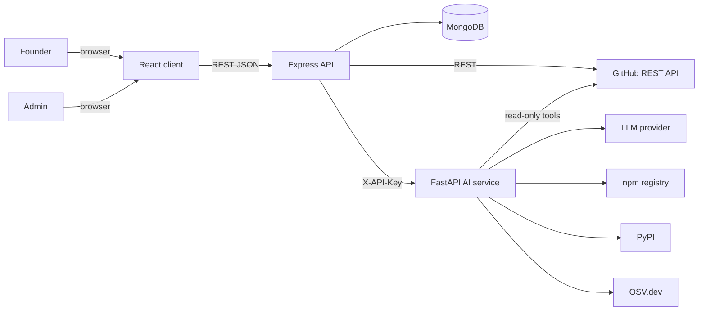
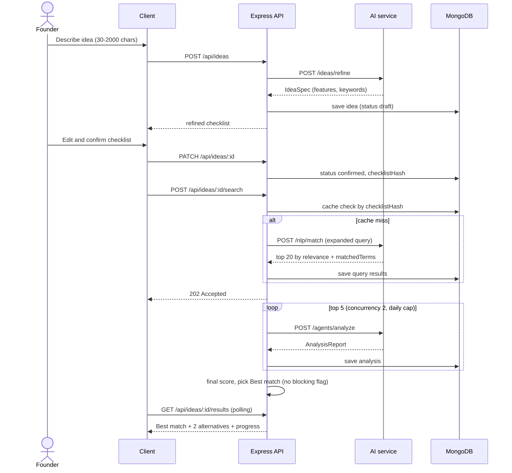
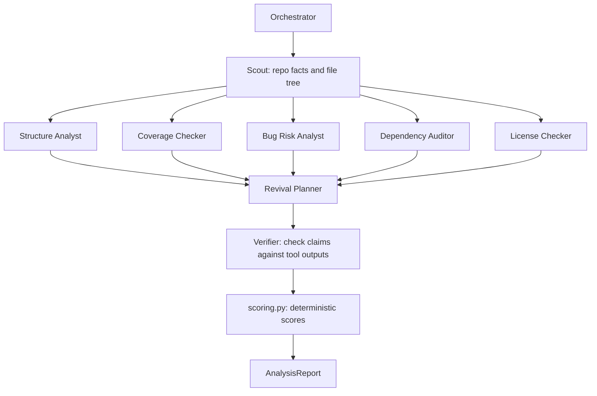
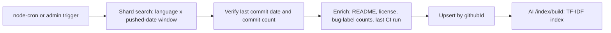

# RepoRevive – System Design

Source of truth for behaviour: `CLAUDE.md`, `docs/REQUIREMENTS.md`, `docs/SCORING_RUBRIC.md`. If this file and those disagree, stop and ask.

## 1. Purpose

A non-technical founder types an idea in plain words. RepoRevive returns the abandoned public GitHub repository that already builds most of it, with the fewest verifiable bug signals and a reusable license. It also lists what is missing and what it would take to finish.

## 2. Design goals

| Goal | How the design meets it |
| --- | --- |
| Founder-first | AI-refined feature checklist that the founder confirms; plain-language UI with tooltips |
| Evidence-backed | Every agent finding carries a file path, API field or URL; the Verifier drops unsupported claims |
| Reproducible | All scores come from deterministic code (`scoring.py`); LLMs only plan, extract and explain |
| Safe | Strictly static and read-only; no third-party code is ever executed, built, installed or imported |
| Cost-bounded | Top 5 analysed automatically, daily cap per user, step and token caps per agent run |
| Explainable in a viva | Custom orchestrator (no CrewAI/LangChain), TF-IDF baseline, small number of moving parts |

## 3. High-level system context

## 4. Components

| Component | Tech | Responsibility |
| --- | --- | --- |
| Client | React 18, Vite, Tailwind, React Router, Axios | Idea wizard, checklist editor, results, repo report, Founder Brief, history, admin |
| API server | Node 20, Express, Mongoose, Zod, JWT, Pino | Auth, ideas, search orchestration, cache, job runner, GitHub ingestion, ranking, **all DB writes** |
| AI service | Python 3.11, FastAPI, Pydantic v2, scikit-learn, NLTK, httpx | Idea Refiner, NLP matcher, agent orchestrator, scoring, provider layer |
| Database | MongoDB 7 (Atlas in production) | users, ideas, repositories, queries, analyses, ingestion_jobs |
| Infra | Docker Compose locally; Render (server, ai-service); Vercel (client) | Run and deploy |

AI service endpoints (internal, `X-API-Key`): `/ideas/refine`, `/index/build`, `/nlp/match`, `/nlp/preprocess`, `/agents/analyze`, `/health`.

## 5. Core flows

### 5.1 Idea to Best match (Flow A)

### 5.2 One repository analysis (Flow B)

### 5.3 Ingestion (Flow C)

## 6. Ranking and scoring (summary)

- Relevance: TF-IDF cosine similarity of the expanded idea query vs the repo document, normalised 0-1 within results.
- Feature coverage (0-100): must-have 2, nice-to-have 1; present 1, partial 0.5, missing 0.
- Viability (0-100): Structure 15, Bug risk 20, Dependency health 15, Documentation 10, License 15, History 10, Tests and CI 15.
- Final = `0.40 x relevance + 0.30 x coverage/100 + 0.30 x viability/100`.
- Blocking flags: `NO_LICENSE`, `ARCHIVED`, `EMPTY_REPO`, `CRITICAL_VULN`.
